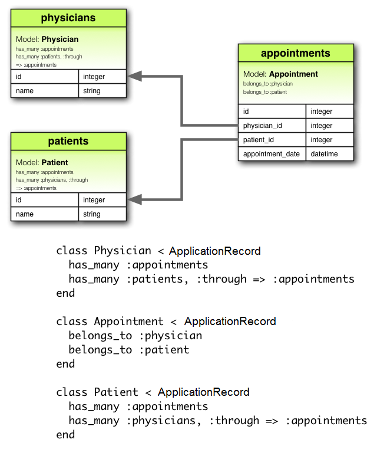
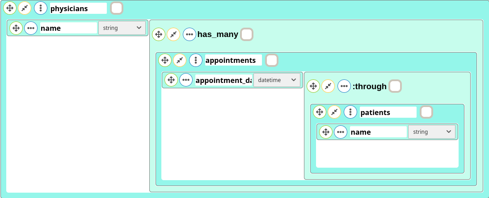
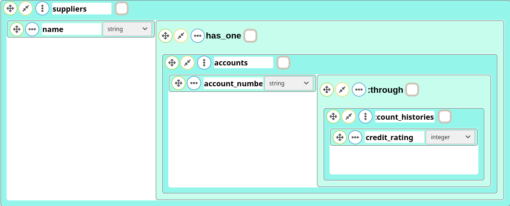

Entity Association Diagram
==========================

This documentation explains how to use EAD(Entity Association Diagram )

After reading this document, you will know:

* How to generate basic associations for Ruby on Rails

--------------------------------------------------------------------------------

The Types of Associations
-------------------------

EAD supports five types of associations:

* [`belongs_to`](#The-belongs_to-Association)
* [`has_one`](#The-has_one-Association)
* [`has_many`](#The-has_many-Association)
* [`has_many :through`](#The-has_many-:through-Association)
* [`has_one :through`](#The-has_one-:through-Association)


In the remainder of this documentation, you'll learn how to declare and use the various forms of associations. But first, a quick introduction to the situations where each association type is appropriate.

[`belongs_to`]: https://api.rubyonrails.org/classes/ActiveRecord/Associations/ClassMethods.html#method-i-belongs_to
[`has_many`]: https://api.rubyonrails.org/classes/ActiveRecord/Associations/ClassMethods.html#method-i-has_many
[`has_one`]: https://api.rubyonrails.org/classes/ActiveRecord/Associations/ClassMethods.html#method-i-has_one

### The `belongs_to` Association

belongs_to association is added automatically.

### The `has_one` Association

For example, if each supplier in your application has only one account, you'd declare the supplier model like this:

```ruby
class Supplier < ApplicationRecord
  has_one :account
end

class Account < ApplicationRecord
  belongs_to :supplier
end
```


The corresponding migration might look like this:

```ruby
class CreateSuppliers < ActiveRecord::Migration[6.1]
  def change
    create_table :suppliers do |t|
      t.string :name

      t.timestamps
    end
  end
end

class CreateAccounts < ActiveRecord::Migration[6.1]
  def change
    create_table :accounts do |t|
      t.string :account_number
      t.references :supplier, null: false, foreign_key: true

      t.timestamps
    end
  end
end
```


### The `has_many` Association

 For example, in an application containing authors and books, the author model could be declared like this:

```ruby
class Author < ApplicationRecord
  has_many :books
end

class Book < ApplicationRecord
  belongs_to :author
end
```


The corresponding migration might look like this:

```ruby
class CreateAuthors < ActiveRecord::Migration[6.1]
  def change
    create_table :authors do |t|
      t.string :name

      t.timestamps
    end
  end
end

class CreateBooks < ActiveRecord::Migration[6.1]
  def change
    create_table :books do |t|
      t.datetime :published_at
      t.references :author, null: false, foreign_key: true

      t.timestamps
    end
  end
end

```


### The `has_many :through` Association

 For example, consider a medical practice where patients make appointments to see physicians. The relevant association declarations could look like this:

```ruby
class Physician < ApplicationRecord
  has_many :appointments
  has_many :patients, through: :appointments
end

class Appointment < ApplicationRecord
  belongs_to :physician
  belongs_to :patient
end

class Patient < ApplicationRecord
  has_many :appointments
  has_many :physicians, through: :appointments
end

```






The corresponding migration might look like this:

```ruby
class CreatePhysicians < ActiveRecord::Migration[6.1]
  def change
    create_table :physicians do |t|
      t.string :name

      t.timestamps
    end
  end
end

class CreatePatients < ActiveRecord::Migration[6.1]
  def change
    create_table :patients do |t|
      t.string :name

      t.timestamps
    end
  end
end

class CreateAppointments < ActiveRecord::Migration[6.1]
  def change
    create_table :appointments do |t|
      t.datetime :appointment_date
      t.references :physician, null: false, foreign_key: true
      t.references :patient, null: false, foreign_key: true

      t.timestamps
    end
  end
end

```

WARNING: The official Ruby on Rails documentation suggesting one more feature of `has_many :through` as "shortcut" for nested `has_many` associations. But, this feature should be added manually for nest `has_many` associations.

### The `has_one :through` Association

For example, if each supplier has one account, and each account is associated with one account history, then the
supplier model could look like this:

```ruby
class Supplier < ApplicationRecord
  has_one :account
  has_one :account_history, through: :account
end

class Account < ApplicationRecord
  belongs_to :supplier
  has_one :account_history
end

class AccountHistory < ApplicationRecord
  belongs_to :account
end
```




The corresponding migration might look like this:

```ruby
class CreateSuppliers < ActiveRecord::Migration[6.1]
  def change
    create_table :suppliers do |t|
      t.string :name

      t.timestamps
    end
  end
end

class CreateAccounts < ActiveRecord::Migration[6.1]
  def change
    create_table :accounts do |t|
      t.string :account_number
      t.references :supplier, null: false, foreign_key: true

      t.timestamps
    end
  end
end

class CreateAccountHistories < ActiveRecord::Migration[6.1]
  def change
    create_table :account_histories do |t|
      t.integer :credit_rating
      t.references :account, null: false, foreign_key: true

      t.timestamps
    end
  end
end
```

### The `has_and_belongs_to_many` Association

`has_and_belongs_to_many` association isn't implemented to make codebase simpler. 

NOTE: If it is necessary, it can be added with the next versions.

### Polymorphic Associations

Polymorphic associations aren't implemented, yet.

NOTE: It is planned to be added with the next versions.

### Self Joins

Self joins aren't implemented, yet.

NOTE: It is planned to be added with the next versions.